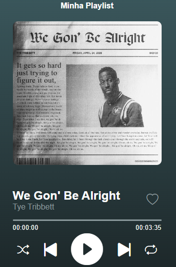

# 🎵 Music Player

A simple and interactive web music player built with JavaScript, HTML, and CSS.  
Enjoy features like play/pause, skip, shuffle, repeat, and like functionality — all in a clean and responsive interface.

## Features

- ▶️ Play and pause songs  
- ⏭️ Skip to next / previous tracks  
- 🔁 Repeat and shuffle options  
- ❤️ Like or unlike songs with persistent storage using `localStorage`  
- 📊 Dynamic progress bar with clickable navigation  
- ⏱️ Displays current time and total duration of the song  
- 📱 Responsive layout (desktop and mobile-friendly)

## Technologies Used

- HTML5  
- CSS3  
- JavaScript (Vanilla)  
- [Bootstrap Icons](https://icons.getbootstrap.com/) for icons  
- `localStorage` for persisting liked songs and playlist order

## Preview



## Getting Started

```bash
# Clone the repository
git clone https://github.com/bessarodrigo/my_spotify_playlist.git

# Navigate into the project folder
cd my_spotify_playlist

# Open the project in your browser
# On macOS (if you have the 'open' command):
open index.html

# On Windows:
start index.html

# On Linux:
xdg-open index.html

# Or simply double-click the index.html file in your file explorer.
